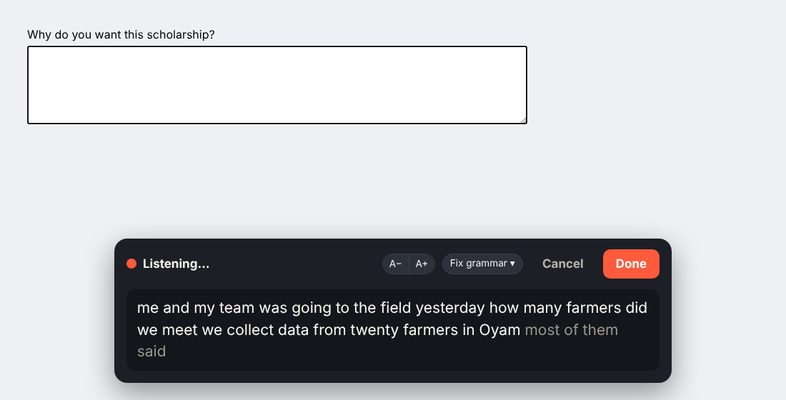
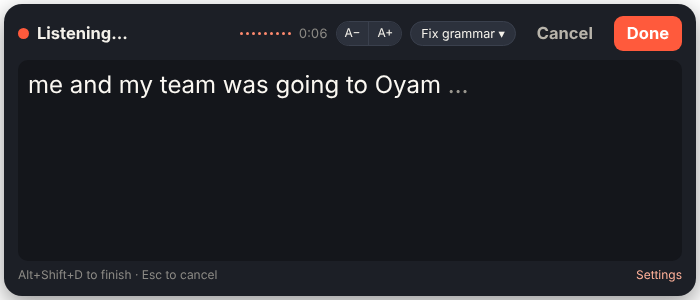

<p align="center"></p>

<h1 align="center">SayIt</h1>
<p align="center"><b>Speak, and your words are typed for you, with the grammar fixed.</b><br>
It never rewrites what you said unless you ask it to.</p>

<p align="center">
  <a href="https://github.com/ambroseonapa/sayit/releases/latest"><b>⬇ Download the latest version</b></a>
</p>



Some boxes need a lot of typing: application forms, emails, comments, reports. SayIt lets you talk instead. Click in the box, tap the mic, speak, and press **Done**. Your words appear in the box with full stops, commas, capital letters and grammar fixed. Your own words stay. Nothing gets "improved" behind your back.

## Two ways to use it

| | **Chrome extension** | **Desktop app** |
|---|---|---|
| Works in | Any website in Chrome (forms, Gmail, Google Docs, LinkedIn…) | **Any app** on Windows or Mac (Word, WhatsApp, Outlook, Notepad…) |
| How you start it | Mic icon in the toolbar, or `Alt+Shift+S` | Floating mic button, or `Alt+Shift+D` |
| Words appear | Each time you pause (same fast engine as the desktop app) | Each time you pause |
| Download | [SayIt-Chrome-extension.zip][ext] | Windows: [installer][win] · [portable zip][winzip]<br>Mac: [Apple Silicon (M1–M4)][macarm] · [Intel][macintel] |

You can use both. They share the same settings ideas and the same free key.

[ext]: https://github.com/ambroseonapa/sayit/releases/latest/download/SayIt-Chrome-extension.zip
[win]: https://github.com/ambroseonapa/sayit/releases/latest/download/SayIt-Setup-Windows.exe
[winzip]: https://github.com/ambroseonapa/sayit/releases/latest/download/SayIt-Windows-portable.zip
[macarm]: https://github.com/ambroseonapa/sayit/releases/latest/download/SayIt-Mac-AppleSilicon.zip
[macintel]: https://github.com/ambroseonapa/sayit/releases/latest/download/SayIt-Mac-Intel.zip

---

## Step 1: Get a free Groq key (5 minutes)

SayIt uses AI to fix grammar (and, in the desktop app, to turn your voice into text). [Groq](https://console.groq.com) gives a free key with no card needed.

1. Go to **[console.groq.com/keys](https://console.groq.com/keys)** and sign in with Google.
2. Click **Create API key**, give it any name, and copy the key (it starts with `gsk_`).
3. Paste it into SayIt's settings (below). Keep it private, like a password.

> **For speech, SayIt needs a Groq key (free, fastest), an OpenAI key or a Google Gemini key.** Any of them works, and you can add more than one. Claude can fix grammar but can't listen to audio, so a Claude key alone isn't enough.
>
> The Chrome extension also works **without** any key, using Chrome's built-in speech and a basic free grammar checker, but it's slower and less accurate.

## Step 2: Install

### Chrome extension

1. Download **[SayIt-Chrome-extension.zip][ext]** and unzip it into a folder you will keep, for example `Documents\SayIt-extension`. (Don't delete this folder; Chrome runs SayIt from it.)
2. In Chrome, open **`chrome://extensions`** and switch on **Developer mode** (top right).
3. Click **Load unpacked** and choose the folder you unzipped (the one with `manifest.json` inside).
4. Click the puzzle-piece icon in Chrome's toolbar and **pin** SayIt.
5. The settings page opens. Under **How grammar gets fixed**, choose **AI**, keep **Groq**, paste your key and press **Test speed**.
6. Under **Speech**, keep **Fast and accurate (Groq)** and click **Allow microphone (once)**. After that SayIt works on every website without asking again.

Also works in Microsoft Edge (`edge://extensions`) and Brave.

### Windows desktop app

1. Download **[SayIt-Setup-Windows.exe][win]** and double-click it.
2. Windows may say **"Windows protected your PC"**, because SayIt isn't signed with a paid certificate yet. Click **More info → Run anyway**. You only do this once.
3. SayIt installs and opens its settings. Paste your Groq key and press **Test**.
4. A round mic button now floats on your screen, and SayIt sits in the tray near the clock. Right-click the tray icon → **Start SayIt when computer starts** to keep it always on.

Prefer not to install? Use the **[portable zip][winzip]**: unzip it anywhere and run `SayIt.exe`.

### Mac desktop app

1. Download the right one: **[Apple Silicon (M1–M4)][macarm]** or **[Intel][macintel]** (Apple menu → About This Mac tells you which).
2. Unzip it and drag **SayIt.app** into **Applications**.
3. Because SayIt isn't signed by Apple yet, open **Terminal** once and paste:
   ```
   xattr -cr /Applications/SayIt.app
   ```
4. Open SayIt. Allow the **microphone** when asked, then paste your Groq key in settings.
5. The first time SayIt types for you, macOS asks for **Accessibility** permission. Go to **System Settings → Privacy & Security → Accessibility** and switch SayIt on. (Until then, SayIt copies your text so you can press `⌘V`.)
6. SayIt lives in the menu bar at the top of the screen.

---

## How to use it

1. **Click where you want to type**: a form box, an email, a document.
2. **Start**: Chrome: tap the SayIt icon or press `Alt+Shift+S`. Desktop: click the floating mic or press `Alt+Shift+D` (`Option+Shift+D` on Mac).
   On the desktop, the box opens **right where you're typing** (just below the line), so your eyes don't have to leave your work.
3. **Speak normally.** You can say *"comma"*, *"full stop"*, *"question mark"*, *"new line"* or *"new paragraph"* if you want, but with an AI key you don't have to.
4. **Finish**: press **Done** or the shortcut again. Your text goes into the box. **Esc** cancels.
5. **Need the text somewhere else?** Press **Copy** in the box to copy what you've said so far, then paste it anywhere.
6. **Changed your mind?** In Chrome a small pill appears for 3 seconds: **Original** puts back your exact words, **↶ Undo** removes it. `Ctrl+Z` (`⌘Z`) also works everywhere.

There is no time limit. Talk for as long as you like; if the internet drops for a moment, SayIt reconnects and keeps listening.

| The desktop mic button | The desktop app while you speak |
|---|---|
|  |  |

---

## Closing SayIt and getting it back (desktop)

- **Hide just the button:** right-click the floating mic → **Hide floating button**. SayIt keeps working with the shortcut (`Alt+Shift+D`).
- **Bring the button back:** right-click the SayIt icon in the tray (Windows, near the clock) or menu bar (Mac) → **Show floating button**. Or simply open SayIt again (next point).
- **Quit completely:** tray / menu-bar icon → **Quit SayIt**.
- **Open it again after quitting:** no need to reinstall. On Windows, open **SayIt** from the Start menu or the desktop shortcut. On Mac, open **SayIt** from Applications. Opening SayIt also brings back a hidden button.
- **Starts with your computer:** SayIt starts automatically when you log in. To stop that, untick **Start SayIt when computer starts** in the tray / menu-bar menu.

## Settings explained

**What should happen to your words?**
- **Exact words**: types exactly what you said.
- **Fix grammar** (recommended): full stops, commas, capitals, question marks and grammar mistakes (*they was → they were*). It never swaps your words for "better" ones or changes your meaning. If the AI ever changes too much, SayIt keeps your original.
- **Polish (keeps my voice)**: for when you speak in pieces, or English is your second language. It joins broken or half-finished sentences so they make sense, fixes the grammar and adds missing small words (*the*, *a*, *to*, *is*). It keeps your meaning and your own words, and does not make you sound like someone else.
- **Rephrase**: rewrites it to read smoothly: removes rambling and repetition, keeps every fact. Pick a style: **Natural**, **Formal** (applications, reports), **Friendly** or **Short and clear**.
- **Write like me** (optional): paste one or two paragraphs you wrote yourself. Polish and Rephrase follow your style from them, so the result still sounds like you.
- **Show the changes before inserting** (off by default): see what was changed (crossed out in red, new words in green) and choose **Insert** or **Use my words**. It's off by default because it adds a step.
- In every mode SayIt never adds long dashes (—), and never adds business words like *leverage*, *foster* or *synergy* unless you said them yourself.
- **Remove "um", "uh" and stutters**: *"um so I I I think"* → *"so I think"*. Real words are never removed.

**Speech (Chrome extension)**
- **Fast and accurate (Groq)**, recommended: the same engine as the desktop app. Your words appear each time you pause, it handles accents and names well, and the text is ready almost as soon as you press Done.
- **Chrome's built-in**: no key needed. Words appear as you speak, but it can lag on slow internet.
- **On this computer**: works without internet, usually less accurate.

**Names and words SayIt should know**: add names and local words (for example *Okidi, Oyam, Makerere*) so they are always spelled right.

**Appearance**
- **Theme**: Light, Dark, or the same as your computer. Applies to the listening box in both apps (and the desktop mic button).
- Chrome: the listening box comes in Medium, Large and Extra large; use **A− / A+** on the box any time.
- Desktop: **drag the top of the box** to move it and **drag its bottom-right corner** to resize it; SayIt remembers the size. Choose where it opens: **where you're typing** (default), **where you last moved it**, or **next to the mic button**. Moving the box never moves the mic button. **A− / A+** changes the text size. The **mic button** comes in Small, Medium and Large.

**Other AI providers**: Groq is the default because it is fast and free, but you can use Google Gemini (free key from AI Studio), OpenAI, Anthropic Claude, OpenRouter, or any OpenAI-compatible service for grammar. Each provider's key is saved separately, so you can switch back and forth without pasting keys again.

**Finish by itself**: optionally stop after 2, 3 or 5 seconds of silence, so you don't need to press Done.

---

## Keeping SayIt up to date

SayIt checks GitHub once a day for a new version. When there is one:
- **Chrome**: the toolbar icon shows a green **new** badge, and the settings page shows a download link.
- **Desktop**: you get a notification, and the tray menu shows **Update available**.

**To update the Chrome extension:** download the new `SayIt-Chrome-extension.zip`, unzip it **over the files in your existing SayIt folder** (replace them), then go to `chrome://extensions` and click the **reload ↻** arrow on SayIt. Your key and settings stay. Reload any open tabs you want to use it in.

**To update the desktop app:** download and run the new installer (Windows) or replace SayIt.app in Applications (Mac, then run the `xattr` line again). Your key and settings stay.

You can also check by hand: Chrome settings page → **Check for updates** (bottom), or desktop tray menu → **Check for updates**.

---

## Privacy: where your voice and text go

SayIt has no server of its own and collects nothing about you. Your keys are stored only on your computer.

| What | Goes to |
|---|---|
| Your voice, **Fast and accurate** / desktop app | Groq (or OpenAI, if that's the key you use) |
| Your voice, Chrome's **built-in** speech | Google's speech service (built into Chrome) |
| Your voice, **On this computer** | Nowhere, it stays on your computer |
| Your text, for grammar fixing | The AI provider you chose (Groq by default), or LanguageTool in free mode |
| Update check | GitHub, once a day (just asks for the latest version number) |

Don't dictate passwords or anything you wouldn't send to these services.

---

## Troubleshooting

| Problem | Fix |
|---|---|
| Desktop: clicking the mic opens settings | SayIt has no Groq (or OpenAI) key. Paste your Groq key in settings. It's needed for speech even if Claude fixes your grammar. |
| Extension: "SayIt needs your permission to use the microphone" | Click **Allow microphone** in that message (or in SayIt settings → Speech). You only do it once. |
| "Microphone is blocked" | Click the icon on the left of the address bar → allow **Microphone**. On a Mac desktop app: System Settings → Privacy & Security → Microphone → SayIt on. |
| Nothing happens when I tap the icon | Click inside a text box first. SayIt can't run on `chrome://` pages or the Chrome Web Store. |
| "API key was rejected" | Paste the key again (no spaces) and press Test. Create a new key on Groq if needed. |
| "Free limit reached" | Groq's free plan has a per-minute limit. Wait a minute. |
| Google Docs | Supported. If Docs refuses the text, SayIt copies it so you can press `Ctrl+V`. |
| Desktop app types into the wrong place | Click in the box you want first, then use the shortcut instead of the button. |
| Windows: some apps don't receive the text | Apps running "as administrator" block other apps from typing into them. Run SayIt as administrator too, or use a normal window. |
| Mac: text is copied but not typed | Turn SayIt on under System Settings → Privacy & Security → **Accessibility**. |
| Desktop: something doesn't work as it should | Right-click the SayIt icon in the tray / menu bar → **Open log (to report a problem)**, and send that file with your report. |

---

## For developers

```
extension/   Chrome extension (Manifest V3). Load this folder unpacked to develop.
desktop/     Desktop app (Electron) for Windows and Mac.
docs/        Screenshots for this page.
.github/     The build that creates the downloads for each release.
```

`extension/shared.js` holds the logic both apps share (AI instructions, providers, helpers). The desktop app copies it in automatically before running or building.

**Run the desktop app from source** (needs [Node.js](https://nodejs.org) 20+):
```
cd desktop
npm install
npm start
```

**Release a new version**
1. Change the version in **both** `extension/manifest.json` and `desktop/package.json` (for example `0.6.0`).
2. Add a `## 0.6.0` section at the top of `CHANGELOG.md`. It becomes the release notes.
3. Commit and push to `main`.

That's all. GitHub Actions notices the new version, builds the Chrome zip, the Windows installer and both Mac apps (about 10–15 minutes), and publishes the release with the files attached. Everyone's SayIt then shows the update. Pushes that don't change the version don't build anything. You can follow the build in the **Actions** tab.

See [CHANGELOG.md](CHANGELOG.md) for what changed in each version.
